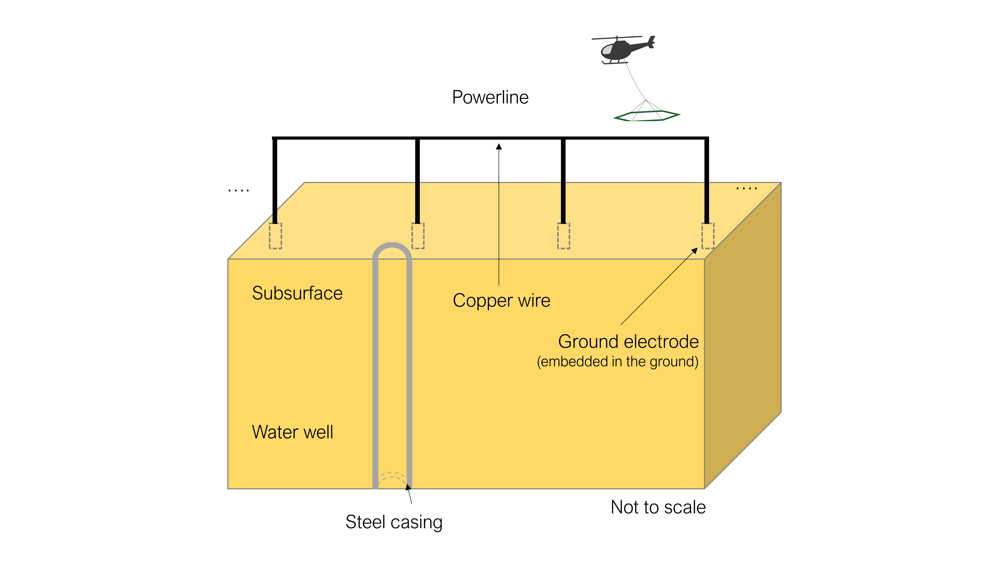
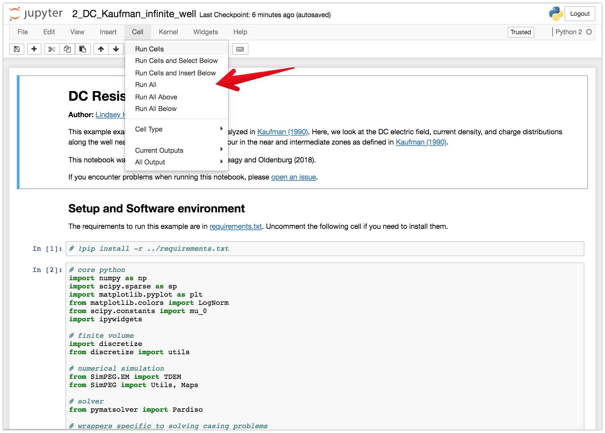

**| [Overview](#overview) | [Launching the notebooks](#launching-the-notebooks) | [Running the notebooks](#running-the-notebooks) | [Citation](#citation) | [Issues](#issues) | [License](#license) |**

# The effect of water wells on time-domain airborne electromagnetic data

[](https://travis-ci.org/simpeg-research/kang-2019-impact-of-wells)
[](https://mybinder.org/v2/gh/simpeg-research/kang-2019-impact-of-wells/master?filepath=index.ipynb)
<!-- [](https://zenodo.org/badge/latestdoi/127807359) -->
[](https://github.com/simpeg-research/kang-2019-impact-of-wells/blob/master/LICENSE)
[](http://simpeg.xyz)

Our research is motivated by obtaining co-located well data and airborne electromagnetic (AEM) data for the purpose of imaging the large-scale subsurface hydrogeologic structure using an AEM technique. Results from an AEM survey in Butte and Glenn Counties, California, U. S. A., where 41 water wells are located within 100 m of the AEM flight lines, provide a unique opportunity to investigate the effect of water wells on AEM data. We perform systematic numerical analyses and examination of the field data to investigate the effects related to water wells on AEM data.

This is a repository where the codes and exmamples used in our paper is released to the public such that other people can run similar analyses to better design their own AEM survey for the purpose of imaging hydrogeologic structure of the subsurface.



## Overview

This repository contains the notebooks used to generate the examples shown in "The effect of water wealls on time-domain airborne electromagnetic data " by [Seogi Kang](https://github.com/sgkang), [Noah Dewar](https://earth.stanford.edu/people/noah-dewar), and [Rosemary Knight](https://earth.stanford.edu/people/rosemary-knight). The list of the notebooks are:

- [notebooks](notebooks): contains the notebooks used to generate figures in the paper and thesis
    - [1-steel-casing-effect.ipynb](notebooks/1-steel-casing-effect.ipynb):
        - Figure 4, 5, 6
    - [2-power-line-plot](notebooks/2-power-line-plot.ipynb):
        - Figure 7
    - [3-accuracy](notebooks/3-accuracy.ipynb):
        - Figures 8
    - [4-nearsurface-resistivity](notebooks/4-nearsurface-resistivity.ipynb):
        - Figures 9
    - [5-n-powerline-loops](notebooks/5-n-powerline-loops.ipynb):
        - Figure 10
    - [6-butte-powerline-effect](notebooks/6-butte-powerline-effect.ipynb)
        - Figures 11, 12
    - [6-2-SIP_inversion_3D_load](notebooks/6-2-SIP_inversion_3D_load.ipynb):
        - Figures 12-14
    - [a-1-background-resistivity](notebooks/a-1-background-resistivity.ipynb)
    - [a-2-layer-thickness](notebooks/a-2-layer-thickness.ipynb)


## Launching the notebooks

### Online
The notebooks can be run online through [mybinder](https://mybinder.org/v2/gh/simpeg-research/kang-2019-impact-of-wells/master?filepath=notebooks%2Findex.ipynb)

### Locally
To run them locally, you will need to have python installed, preferably through [anaconda](https://www.anaconda.com/download/).

You can then clone this repository. From a command line, run

```
git clone https://github.com/simpeg-research/kang-2019-impact-of-wells.git
```

Then `cd` into the `kang-2019-impact-of-wells`

```
cd kang-2019-impact-of-wells
```

To setup your software environment, we recommend you use the provided conda environment

```
conda env create -f environment.yml
source activate sip-environment
```

alternatively, you can install dependencies through pypi
```
pip install -r requirements.txt
```

You can then launch Jupyter
```
jupyter notebook
```

Jupyter will then launch in your web-browser.

## Running the notebooks

Each cell of code can be run with `shift + enter` or you can run the entire notebook by selecting `cell`, `Run All` in the toolbar.



For more information on running Jupyter notebooks, see the [Jupyter Documentation](https://jupyter.readthedocs.io/en/latest/)

## Citation

Kang, S., Dewar, N.,& Knight, R. (2020).

```
@article{kang2020,
author = {Kang, Seogi,  Dewar, Noah, and Knight, Rosemary},
journal = {TBA},
number = {},
pages = {},
title = {{The effect of water wealls on time-domain airborne electromagnetic data.}},
volume = {},
year = {2020}
}
```

## Issues

If you run into problems or bugs, please let us know by [creating an issue](https://github.com/simpeg-research/kang-2019-impact-of-wells/issues/new) in this repository.

## License

These notebooks are licensed under the [MIT License](/LICENSE) which allows academic and commercial re-use and adaptation of this work.

## Version

Version: 0.0.1
